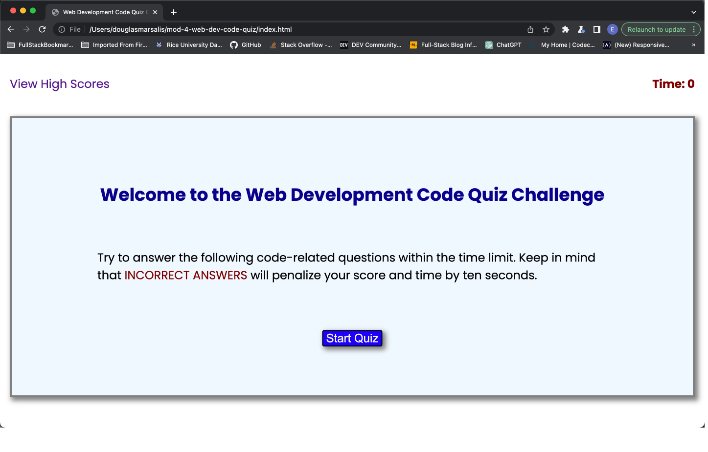

# mod-4-web-dev-code-quiz

## Description 

- First item As a web developer, I want tobe able to practice for a knowledge qiz given at interviews by companies and be able to compare my results to my peers.
- Second item I want to create a site that is appealing to the eye by using a good design and good color schemes.
- Third item I want a website that is responsive to any screens that will be used to view my site.
- Fourth item I will make sure the code follows industry standards and is sourced correctly.
-Fifth item By building this webpage, it also helped me to learn inforamtion on HTML, CSS, JavaScript, Git, GitHub, README markdown information, and Deployment.

## User Story 

AS A coding boot camp student
I WANT to take a timed quiz on JavaScript fundamentals that stores high scores
SO THAT I can gauge my progress compared to my peers.

## Acceptance Criteria

GIVEN I am taking a code quiz
WHEN I click the start button
THEN a timer starts and I am presented with a question
WHEN I answer a question
THEN I am presented with another question
WHEN I answer a question incorrectly
THEN time is subtracted from the clock
WHEN all questions are answered or the timer reaches 0
THEN the game is over
WHEN the game is over
THEN I can save my initials and score

## Sources
- First item Various websites for how to do certain tasks: 
            W3 Schools - https://www.w3schools.com/ 
            Stackoverflow - https://stackoverflow.com/
            Mozilla mdn - https://developer.mozilla.org/en-US/ 
- Second item Seeing what other WDs are doing for the task:
            https://github.com/Jefid/timed-quiz/blob/main/index.html
            https://github.com/nhanng19/timed_quiz
- Third item Quiz question ideas:
            https://www.proprofs.com/quiz-school/topic/web-development
- Fourth item Rice University mini project:
            https://git.bootcampcontent.com/Rice-University/RICE-VIRT-
            FSF-PT-05-2023-U-LOLC/-/blob/main/04-Web-APIs/01-Activities/
            28-Stu_Mini-Project/_Main/assets/js/script.js 
- Fifth item Also, I would like to thank Daniel for reviewing my code and 
            helping me with my JavaScript issues.          

## Link to Deployed Site

https://douglasmarsalis.github.io/mod-4-web-dev-code-quiz/

## Link to Github Repository

https://github.com/douglasmarsalis/mod-4-web-dev-code-quiz

## Screenshot of Webpage

## License

MIT License

Copyright (c) 2023 Douglas Eric Marsalis

Permission is hereby granted, free of charge, to any person obtaining a copy of this software and associated documentation files (the "Software"), to deal in the Software without restriction, including without limitation the rights to use, copy, modify, merge, publish, distribute, sublicense, and/or sell copies of the Software, and to permit persons to whom the Software is furnished to do so, subject to the following conditions:

The above copyright notice and this permission notice shall be included in all copies or substantial portions of the Software.

THE SOFTWARE IS PROVIDED "AS IS", WITHOUT WARRANTY OF ANY KIND, EXPRESS OR IMPLIED, INCLUDING BUT NOT LIMITED TO THE WARRANTIES OF MERCHANTABILITY, FITNESS FOR A PARTICULAR PURPOSE AND NONINFRINGEMENT. IN NO EVENT SHALL THE AUTHORS OR COPYRIGHT HOLDERS BE LIABLE FOR ANY CLAIM, DAMAGES OR OTHER LIABILITY, WHETHER IN AN ACTION OF CONTRACT, TORT OR OTHERWISE, ARISING FROM, OUT OF OR IN CONNECTION WITH THE SOFTWARE OR THE USE OR OTHER DEALINGS IN THE SOFTWARE.
